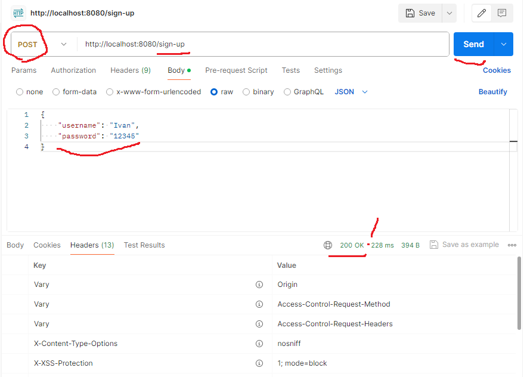
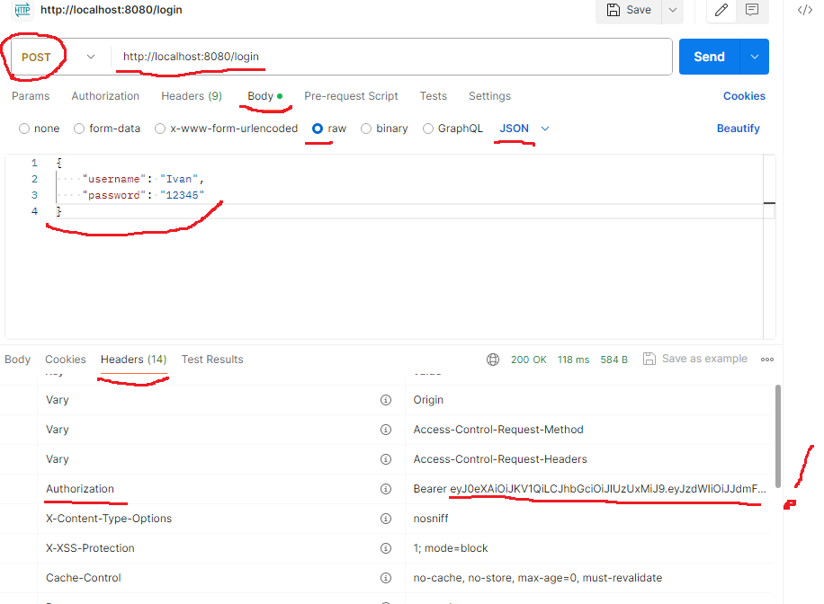
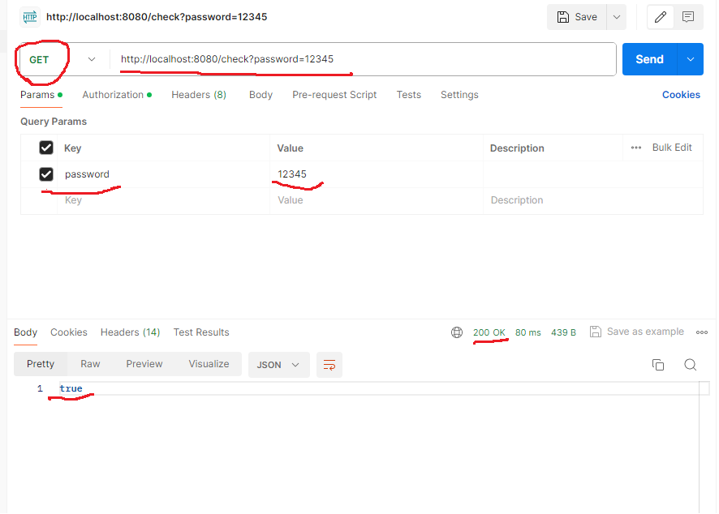

# AuthApiApp

# ТЗ
Используя SpringBoot создать api аутентификации: 

Метод принимает пароль и юзернейм и добавляет их в сессионный кэш одной строкой (желательно в безопасном виде) 

Метод принимает пароль или хэш пароля и проверяет есть ли в кэше данный юзер и возвращает да/нет  

Написать юнит тесты на оба метода 

В ридми добавить тестовые данные для проверки апи через постман и пара слов о выбранном решение 
Прислать  ссылку на гит, где лежит выполненное задание) 

# Описание 
По ТЗ указанно "создать api" это скорее всего иметься ввиду создать REST api  
(речь идет НЕ про обычный @Controller, который взаимодействует с MVC представлением/html страницами),  
а поскольку в Rest состояние не сохраняется на сервере (stateless),  
то надо сделать аутентификацию с помощью токенов JWT, JWT хранится на клиенте.  
Вариант с JWT + храние пользователей в памяти ConcurrentHashMap<String, Person>.  
Последовательность действий для проверки логики через POSTMAN:  
Тестовые данные для проверки -JSON с полями username = “Ivan”, password = “12345”:  

{
"username": "Ivan",
"password": "12345"
}
1)  стучимся по URL регистрации http://localhost:8080/sign-up  
 В POSTMAN выбираем тип запроса POST. Указываем URL (http://localhost:8080/ sign-up).  
 Переходим на вкладку “raw” и указываем JSON с полями username = “Ivan”, password = “12345” (см. картинку). Жмем “Send”  
 в ответ получаем статус 200, запрос выполнился успешно.  

  
Рисунок 1. запрос на регистрацию и ответ со статусом 200 (выполнен удачно)  

2) стучимся по URL что бы получить JWT токен http://localhost:8080/login  
 В POSTMAN выбираем тип запроса POST. Указываем URL (http://localhost:8080/login).  
 Переходим на вкладку “raw” и указываем JSON с полями (см. картинку). Жмем “Send”  
 в ответ получаем статус 200. Переходим во вкладку Headers и там ищем и копируем наш токен в строке Authorization, после Bearer  

  
Рисунок 2. запрос на авторизацию пользователя, получения токена  

3) стучимся по URL в метод check, предварительно получив токен в предыдущем действии,  
 что бы проверить присутствие юзера в хранилище (ConcurrentHashMap) http://localhost:8080/check?password=12345  
 В POSTMAN выбираем тип запроса POST. Указываем URL (http://localhost:8080/check?password=12345).  
 Во вкладке “Params” указываем передаваемый параметр, не в теле запроса (как в POST),  
 а в виде параметра строки запроса/заголовок: password = “12345”.  
 в ответ получаем статсус 200 и boolean значение “true”. Это свидетельствует о правильности работы нашей логик,  
 в хранилище присутсвует пользователь с данным паролем  

  
Рисунок 3. запрос на присутсвие пользователя с данным паролем, необходим токен для выполенния или отвтет со стасум 403  

Логика работы метода: Проверяет, существует ли пользователь с указанным паролем.  
* BCrypt — это алгоритм одностороннего хеширования, уникальный  
* хеш невозможно преобразовать для получения исходного пароля.  
* С помощью BCrypt.matches() можно сравнить необработанный  
* пароль (введенный пользователем) с сохраненным хешем.  
* @param rawPassword пароль в открытом виде (не хэшированный)  
* @return true если найден пользователь с совпадающим паролем  